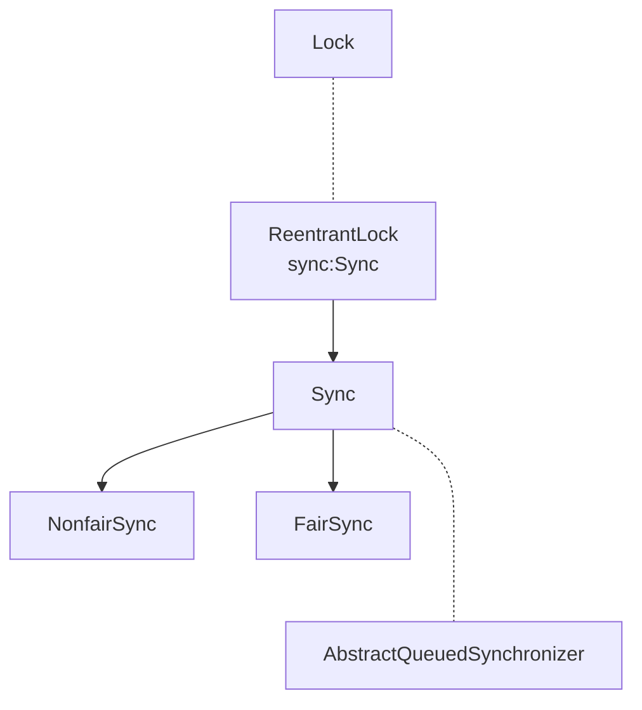

::: warning 注意
下面所有的描述都是基于 `JDK8`，后续版本可能有些改动
:::


## 提要：

### 关键词解析：

`acquire`：抢占，锁资源抢占动作

`release`：释放，锁资源释放动作

`lock`：加锁动作

`fair`：公平，相应的Nonfair 就是非公平了

`exclusive`：独占


### ReentrantLock是什么？

ReentrantLock字面意思就是可重入锁。

和 `synchronized` 一样是互斥锁，但其本身与`synchronized` 有一些差异。

其支持公平锁和非公平锁两种创建方式。


### 什么是可重入锁？

所谓的可重入就是说，对于一个已经拥有了锁资源的线程，它可以针对这个锁资源重复的进行加锁动作【具体表现为：重复调用某个需要相同锁的方法】。相应的，它也需要重复的释放锁，加锁多少次，释放锁多少次。


### 与`synchronized`的区别

|    **项**   |    **synchronized**    |    **ReentrantLock**    |
| ---------------- | -------------------------- | ----------------|
| **用法不同**     | 无需手动释放锁，使用简单| 需要手动加锁和释放，可配合Condition 操作，比较灵活 |
| **锁类型**       | 只有非公平锁          | 支持非公平锁和公平锁   |
| **响应中断不同** | 不能响应中断           | 可支持响应中断        |
| **底层实现不同** | JVM层面通过监视器（Monitor）实现的 | API层面实现的，底层为 AQS |


## ReentrantLock创建

ReentrantLock 内部有一个私有的同步器`private final Sync sync;`，创建实例时，会对其进行进行赋值操作。其内部有两个同步器的实现：`NonfairSync`：非公平同步器，`FairSync`：公平同步器。


### 公平和非公平同步器

在了解创建锁之前，先了解一下其内部的实现。



#### `Sync`：

这个是 公平同步器和非公平同步器的父级，内部加入了基础的公共方法以及通用实现

```java
abstract static class Sync extends AbstractQueuedSynchronizer {
        private static final long serialVersionUID = -5179523762034025860L;

        /**
         * 加锁
         */
        abstract void lock();

        /**
         * 非公平方式获取锁
         * @param acquires 加锁的次数
         */
        final boolean nonfairTryAcquire(int acquires) {
            // 获取当前线程
            final Thread current = Thread.currentThread();
            // 获取锁的状态，如果是 0 就说明没有被占用
            int c = getState();

            if (c == 0) {// 没有被占用
                if (compareAndSetState(0, acquires)) {// 通过CAS 进行状态变更
                    // 设置当前线程独占
                    setExclusiveOwnerThread(current);
                    return true;
                }
            }
            else if (current == getExclusiveOwnerThread()) {// 如果当前线程为独占线程，即是锁的资源拥有者
                int nextc = c + acquires;// 锁次数叠加
                if (nextc < 0) // 判断是否超出 int 的范围，所以非公平锁的最大获取次数就是 Integer.MAX_VALUE
                    throw new Error("Maximum lock count exceeded");
                setState(nextc);// 设置锁状态：对于互斥锁而言，state 就是某个获取锁资源的线程的加锁次数
                return true;
            }
            return false;
        }

    	/**
    	 * 尝试释放锁
    	 * @param releases 释放的次数
    	 */
        protected final boolean tryRelease(int releases) {
            // 计算出释放锁之后的状态，即：释放之后的加锁次数
            int c = getState() - releases;
            // 如果当前线程并不是锁资源的独占线程，抛出异常
            if (Thread.currentThread() != getExclusiveOwnerThread())
                throw new IllegalMonitorStateException();
            
            // 上述判断过完之后，也就表明当前线程是独占线程，继续执行下面的操作
            
            // 定义返回状态，即：锁是否完全释放
            boolean free = false;
            
            if (c == 0) {// 如果释放之后的锁状态为 0 ，即：无锁状态
                free = true;
                // 清除独占线程
                setExclusiveOwnerThread(null);
            }
            // 设置锁状态 即：释放之后的加锁次数
            setState(c);
            return free;
        }

    	/**
    	 * 封装方法：判断当前线程是否为线程资源独占线程
    	 */
        protected final boolean isHeldExclusively() {
            // While we must in general read state before owner,
            // we don't need to do so to check if current thread is owner
            return getExclusiveOwnerThread() == Thread.currentThread();
        }

    	/**
    	 * 获取一个 Condition ，这个类可以配合 ReentrantLock 进行线程的操作
    	 */
        final ConditionObject newCondition() {
            return new ConditionObject();
        }

        // Methods relayed from outer class
		/**
		 * 获取拥有锁资源的独占线程
		 */
        final Thread getOwner() {
            return getState() == 0 ? null : getExclusiveOwnerThread();
        }

    	/**
    	 * 获取当前线程加锁次数
    	 */
        final int getHoldCount() {
            return isHeldExclusively() ? getState() : 0;
        }

    	/**
    	 * 判断资源是否被加锁
    	 */
        final boolean isLocked() {
            return getState() != 0;
        }

        /**
         * Reconstitutes the instance from a stream (that is, deserializes it).
         */
        private void readObject(java.io.ObjectInputStream s)
            throws java.io.IOException, ClassNotFoundException {
            s.defaultReadObject();
            setState(0); // reset to unlocked state
        }
    }
```


#### `NonfairSync`：

非公平同步器

```java
static final class NonfairSync extends Sync {
        private static final long serialVersionUID = 7316153563782823691L;

        /**
         * 加锁操作：先执行 CAS 操作，如果执行失败了，就尝试非公平方式获取锁
         * 这个非公平也体现在这里，直接进行锁的抢占，没抢成功才执行 acquire
         */
        final void lock() {
            // 直接修改 state ，这个动作其实对于互斥锁而言就是加锁操作
            if (compareAndSetState(0, 1))
                // 设置当前线程为独占线程
                setExclusiveOwnerThread(Thread.currentThread());
            else
                // 抢占锁动作，参数为加锁的次数
                // 这个底层调用其实会指向其实现的 tryAcquire() 方法，如果没有获取成功，会入队
                acquire(1);
        }

		/**
         * 尝试进行锁的抢占，
         * @param acquires 加锁的次数
         */
        protected final boolean tryAcquire(int acquires) {
            // 这个调用的是 其父级 Sync 内的方法，上面有解析
            return nonfairTryAcquire(acquires);
        }
    }
```


#### `FairSync`：

公平同步器

```java
static final class FairSync extends Sync {
        private static final long serialVersionUID = -3000897897090466540L;

    	// 加锁操作：这里是直接调用尝试锁抢占的方法，不会进行加锁尝试的操作。
        final void lock() {
            acquire(1);
        }

        /**
         * 尝试锁的抢占
         * @param acquires 加锁次数
         */
        protected final boolean tryAcquire(int acquires) {
            // 获取当前线程
            final Thread current = Thread.currentThread();
            // 获取加锁状态
            int c = getState();
            
            if (c == 0) {// 如果没加锁
                // hasQueuedPredecessors()判断是否有前面排队的线程
                // CAS 进行加锁
                if (!hasQueuedPredecessors() &&
                    compareAndSetState(0, acquires)) {
                    // 设置线程独占
                    setExclusiveOwnerThread(current);
                    return true;
                }
            }
            else if (current == getExclusiveOwnerThread()) {// 如果当前线程为独占线程，这些操作和非公平锁的一致，就不写了
                int nextc = c + acquires;
                if (nextc < 0)
                    throw new Error("Maximum lock count exceeded");
                setState(nextc);
                return true;
            }
            return false;
        }
    }
```


### 创建方式

```java
// 无参构造函数
public ReentrantLock() {
    sync = new NonfairSync();
}

// 有参构造函数
public ReentrantLock(boolean fair) {
    sync = fair ? new FairSync() : new NonfairSync();
}
```

根据上面的两个构造函数可以知道，使用`new ReentrantLock()` 的方式创建的是非公平模式的锁，使用`new ReentrantLock(boolean fair)`可以根据参数进行选择创建什么模式的锁。


## 内部方法释义：

其实内部方法的调用都是内部的`sync`同步器的方法调用。根据创建选定的锁模式，进行方法的分流。


### lock()

加锁

```java
public void lock() {
    sync.lock();
}
```


### lockInterruptibly()

可中断加锁，调用了 AQS 的 `acquireInterruptibly`方法

```java
public void lockInterruptibly() throws InterruptedException {
    sync.acquireInterruptibly(1);
}
```


### tryLock()

会进行非公平加锁。所以 `nonfairTryAcquire()`是卸载 Sync 里面而不是 NonfairSync 里面。

```java
public boolean tryLock() {
    return sync.nonfairTryAcquire(1);
}
```


### tryLock(long timeout, TimeUnit unit)

设定 超时时间 和 超时时间单位 的加锁操作

```java
public boolean tryLock(long timeout, TimeUnit unit)
        throws InterruptedException {
    return sync.tryAcquireNanos(1, unit.toNanos(timeout));
}
```


### unlock()

释放锁

```java
public void unlock() {
    sync.release(1);
}
```


### newCondition()

创建一个 Condition

```java
public Condition newCondition() {
    return sync.newCondition();
}
```


### getHoldCount()

获取当前线程的加锁次数

```java
public int getHoldCount() {
    return sync.getHoldCount();
}
```


### isHeldByCurrentThread()

判断当前线程是否是锁资源的独占线程

```java
public boolean isHeldByCurrentThread() {
    return sync.isHeldExclusively();
}
```


### isLocked()

判断锁资源是否被线程独占。即：判断是否有线程获取锁了。

```java
public boolean isLocked() {
    return sync.isLocked();
}
```


### isFair()

判断当前的锁是否是公平锁

```java
public final boolean isFair() {
    return sync instanceof FairSync;
}
```


### getOwner()

获取独占锁资源的线程

```java
protected Thread getOwner() {
    return sync.getOwner();
}
```


### hasQueuedThreads()

判断是否有排队获取锁的线程

```java
public final boolean hasQueuedThreads() {
    return sync.hasQueuedThreads();
}
```


### hasQueuedThread()

判断当前线程是否是等待线程

```java
public final boolean hasQueuedThread(Thread thread) {
    return sync.isQueued(thread);
}
```


### getQueueLength()

获取线程等待队列的长度，即：获取当前有多少线程在等待获取锁

```java
public final int getQueueLength() {
    return sync.getQueueLength();
}
```


### getQueuedThreads()

获取排队的线程集合

```java
protected Collection<Thread> getQueuedThreads() {
    return sync.getQueuedThreads();
}
```


### hasWaiters(Condition condition)

判断是否有等待指定 Condition 的线程

```java
public boolean hasWaiters(Condition condition) {
    if (condition == null)
        throw new NullPointerException();
    if (!(condition instanceof AbstractQueuedSynchronizer.ConditionObject))
        throw new IllegalArgumentException("not owner");
    return sync.hasWaiters((AbstractQueuedSynchronizer.ConditionObject)condition);
}
```


### getWaitQueueLength(Condition condition)

获取等待指定 Condition 的线程个数

```java
public int getWaitQueueLength(Condition condition) {
    if (condition == null)
        throw new NullPointerException();
    if (!(condition instanceof AbstractQueuedSynchronizer.ConditionObject))
        throw new IllegalArgumentException("not owner");
    return sync.getWaitQueueLength((AbstractQueuedSynchronizer.ConditionObject)condition);
}
```


### getWaitingThreads(Condition condition)

获取等待指定 Condition 的线程集合

```java
protected Collection<Thread> getWaitingThreads(Condition condition) {
    if (condition == null)
        throw new NullPointerException();
    if (!(condition instanceof AbstractQueuedSynchronizer.ConditionObject))
        throw new IllegalArgumentException("not owner");
    return sync.getWaitingThreads((AbstractQueuedSynchronizer.ConditionObject)condition);
}
```


