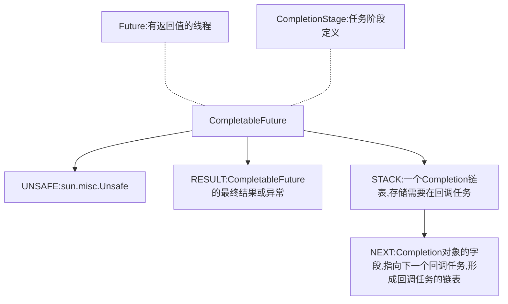

## CompletableFuture是什么？

CompletableFuture是`Future`的实现，可以进行异步任务计算，是实现了对任务编排的能力。其通过`Unsafe`实现原子操作，内部有一个`Completion`链表用于存储回调任务信息。


内部大致结构：




## 常用方法：

::: important 提示 
很多方法都有对应的`xxxAsync`实现，其实内容是一致的，只是调用方式变成了异步的。
方法有多种调用方式，下面的案例只是给出了部分，可自行探索。
:::


### 1.实例创建方式：

- `supplyAsync`：有两个方法，传入一个`Supplier`实现 支持lambda表达式，支持自定义线程池，返回类型会根据传入的`Supplier`进行推断。

  - 案例

    ```java
    CompletableFuture<String> future = CompletableFuture.supplyAsync(() -> "supplyAsync形式创建:方法是Supplier实现，有返回值");
    ```

- `runAsync`：有两个方法，传入一个`Runnable`实现 支持lambda表达式，支持自定义线程池，返回类型是`Void`

  - 案例

    ```java
    CompletableFuture<Void> runAsync = CompletableFuture.runAsync(() -> System.out.println("runAsync形式创建:返回类型Void，方法是Runnable实现，无返回值"));
    ```

- `completedFuture`：返回一个已完成的`CompletableFuture`

  - 案例

    ```java
    CompletableFuture<String> completedFuture = CompletableFuture.completedFuture("completedFuture类型创建:已完成的CompletableFuture，内容是返回值");
    ```

- `new CompletableFuture<>()`：创建一个空的`CompletableFuture`

  - 案例

    ```java
    // new CompletableFuture<>() 形式创建
    CompletableFuture<Integer> completableFuture = new CompletableFuture<>();
    ```


### 2.转换和组合方法：

- `thenApply`：由一个`CompletableFuture`实例调用，将前面执行任务的结果，交给后面的`Function`。返回一个新`CompletableFuture`实例

  - 案例：

    ```java
    public class CompletableFutureTest {
    
        public static void main(String[] args) {
            CompletableFuture<String> future = CompletableFuture.supplyAsync(() -> {
                System.out.println("future 开始执行：" + System.currentTimeMillis());
                try {
                    TimeUnit.SECONDS.sleep(2);
                } catch (InterruptedException e) {
                    throw new RuntimeException(e);
                }
                System.out.println("future 执行完毕：" + System.currentTimeMillis());
                return "返回值T1";
            });
    
            // 这个 thenApply 传入的是 Function 实现，有一个参数
            future.thenApply((result) -> {
                System.out.println("第一步执行结果：" + result);
                System.out.println("第二步执行");
                return "第二步执行";
            });
    
            // 这个 thenApplyAsync 传入的是 Function 实现，有一个参数
            future.thenApplyAsync((result) -> {
                System.out.println("第1步执行结果：" + result);
                System.out.println("第2步执行");
                return "第2步执行";
            });
    
    
            // 这里懒得抛异常
            future.join();
        }
    }
    ```

  - 输出结果：

    ```shell
    future 开始执行：1716028682086
    future 执行完毕：1716028684096
    第一步执行结果：返回值T1
    第二步执行
    第1步执行结果：返回值T1
    第2步执行
    ```

- `thenCompose`：将前面执行任务的结果传递给第二个`CompletableFuture`，可对前一个`CompletableFuture`和后一个的结果进行组合处理，返回一个新`CompletableFuture`实例。

  - 案例

    ```java
    public class CompletableFutureTest {
    
        public static void main(String[] args) {
            CompletableFuture<String> future = CompletableFuture.supplyAsync(() -> {
                System.out.println("future 开始执行：" + System.currentTimeMillis());
                try {
                    TimeUnit.SECONDS.sleep(2);
                } catch (InterruptedException e) {
                    throw new RuntimeException(e);
                }
                System.out.println("future 执行完毕：" + System.currentTimeMillis());
                return "返回值T1";
            });
    
            // thenCompose 传入的 Function实现，传入一个参数，返回值规定为 CompletionStage 的实现【CompletableFuture】
            CompletableFuture<String> thenCompose = future.thenCompose((result) -> CompletableFuture.supplyAsync(() -> {
                System.out.println("thenCompose执行");
                return result + "返回值T二";
            }));
            // thenComposeAsync 和 thenCompose差不多，就是方式不同
            CompletableFuture<String> thenComposeAsync = future.thenComposeAsync((result) -> CompletableFuture.supplyAsync(() -> {
                System.out.println("thenComposeAsync执行");
                return result + "返回值T2";
            }));
    
    
            // 这里懒得抛异常
            future.join();
        }
    }
    ```

  - 输出结果

    ```java
    future 开始执行：1716029072423
    future 执行完毕：1716029074425
    thenComposeAsync执行
    thenCompose执行
    ```

- `thenCombine`：合并处理任务，可对合并的成员任务结果进行处理，返回一个新`CompletableFuture`实例。

  - 案例

    ```java
    public class CompletableFutureTest {
    
        public static void main(String[] args) {
            CompletableFuture<String> future = CompletableFuture.supplyAsync(() -> {
                System.out.println("future 开始执行：" + System.currentTimeMillis());
                try {
                    TimeUnit.SECONDS.sleep(2);
                } catch (InterruptedException e) {
                    throw new RuntimeException(e);
                }
                System.out.println("future 执行完毕：" + System.currentTimeMillis());
                return "返回值T1";
            });
    
            // thenCombine 传入两个参数：
            // 1.CompletionStage实现：【CompletableFuture】
            // 2.BiFunction实现：方法有两个参数，是前面两个 CompletableFuture 的返回值，有返回值
            CompletableFuture<String> thenCombine = future.thenCombine(CompletableFuture.supplyAsync(() -> {
                System.out.println("thenCompose执行");
                return "返回值T二";
            }), (result1, result2) -> {
                System.out.println(result1 + result2);
                return result1 + result2;
            });
            // thenComposeAsync 和 thenCombine 差不多，就是方式不同
            CompletableFuture<String> thenCombineAsync = future.thenCombineAsync(CompletableFuture.supplyAsync(() -> {
                System.out.println("thenComposeAsync执行");
                return "返回值T2";
            }), (result1, result2) -> {
                System.out.println(result1 + result2);
                return result1 + result2;
            });
    
    
            // 这里懒得抛异常
            future.join();
        }
    }
    ```

  - 输出结果

    ```shell
    future 开始执行：1716029595978
    thenCompose执行
    thenComposeAsync执行
    future 执行完毕：1716029597983
    返回值T1返回值T二
    返回值T1返回值T2
    ```

- `thenAcceptBoth`：两个任务处理完成之后，对合并的成员任务结果进行处理，无返回值

  - 案例

    ```java
    public class CompletableFutureTest {
    
        public static void main(String[] args) {
            CompletableFuture<String> future = CompletableFuture.supplyAsync(() -> {
                System.out.println("future 开始执行：" + System.currentTimeMillis());
                try {
                    TimeUnit.SECONDS.sleep(2);
                } catch (InterruptedException e) {
                    throw new RuntimeException(e);
                }
                System.out.println("future 执行完毕：" + System.currentTimeMillis());
                return "返回值T1";
            });
    
            // thenAcceptBoth 传入两个参数：
            // 1.CompletionStage 实现：【CompletableFuture】
            // 2.BiConsumer 实现：方法有两个参数，是前面两个 CompletableFuture 的返回值，无返回值
            CompletableFuture<Void> thenAcceptBoth = future.thenAcceptBoth(CompletableFuture.supplyAsync(() -> {
                System.out.println("thenCompose执行");
                return "返回值T二";
            }), (result1, result2) -> {
                System.out.println(result1 + result2);
            });
            // thenAcceptBothAsync 和 thenAcceptBoth 差不多，就是方式不同
            CompletableFuture<Void> thenAcceptBothAsync = future.thenAcceptBothAsync(CompletableFuture.supplyAsync(() -> {
                System.out.println("thenComposeAsync执行");
                return "返回值T2";
            }), (result1, result2) -> {
                System.out.println(result1 + result2);
            });
    
    
            // 这里懒得抛异常
            future.join();
        }
    }
    ```

  - 输出结果

    ```shell
    future 开始执行：1716029781474
    thenCompose执行
    thenComposeAsync执行
    future 执行完毕：1716029783483
    返回值T1返回值T二
    返回值T1返回值T2
    ```

- `runAfterBoth`：两个任务都执行完毕之后，执行下一步操作：【`Runnable`类型任务，支持lambda表达式】

  - 案例

    ```java
    public class CompletableFutureTest {
    
        public static void main(String[] args) {
            CompletableFuture<String> future = CompletableFuture.supplyAsync(() -> {
                System.out.println("future 开始执行：" + System.currentTimeMillis());
                try {
                    TimeUnit.SECONDS.sleep(2);
                } catch (InterruptedException e) {
                    throw new RuntimeException(e);
                }
                System.out.println("future 执行完毕：" + System.currentTimeMillis());
                return "返回值T1";
            });
    
            // runAfterBoth 传入两个参数：
            // 1.CompletionStage 实现：【CompletableFuture】
            // 2.Runnable 实现：无参数，无返回值
            CompletableFuture<Void> runAfterBoth = future.runAfterBoth(CompletableFuture.supplyAsync(() -> {
                System.out.println(" runAfterBoth 执行");
                return "返回值T二";
            }), () -> {
                System.out.println("runAfterBoth");
            });
            // runAfterBothAsync 和 runAfterBoth 差不多，就是方式不同
            CompletableFuture<Void> runAfterBothAsync = future.runAfterBothAsync(CompletableFuture.supplyAsync(() -> {
                System.out.println("runAfterBothAsync 执行");
                return "返回值T2";
            }), () -> {
                System.out.println("runAfterBothAsync");
            });
    
    
            // 这里懒得抛异常
            future.join();
    
        }
    }
    ```

  - 输出结果

    ```java
    runAfterBoth 执行
    future 开始执行：1716030020702
    runAfterBothAsync 执行
    future 执行完毕：1716030022719
    runAfterBoth
    runAfterBothAsync
    ```

- `applyToEither`：两个任务哪个先执行完毕，就拿哪个的结果信息，返回一个新`CompletableFuture`实例。

  - 案例

    ```java
    public class CompletableFutureTest {
    
        public static void main(String[] args) {
            CompletableFuture<String> future = CompletableFuture.supplyAsync(() -> {
                System.out.println("future 开始执行：" + System.currentTimeMillis());
                try {
                    TimeUnit.SECONDS.sleep(2);
                } catch (InterruptedException e) {
                    throw new RuntimeException(e);
                }
                System.out.println("future 执行完毕：" + System.currentTimeMillis());
                return "返回值T1";
            });
    
            // runAfterBoth 传入两个参数：
            // 1.CompletionStage 实现：【CompletableFuture】
            // 2.Function 实现：一个参数【前一个 CompletableFuture 的返回值】，一个返回值
            CompletableFuture<String> applyToEither = future.applyToEither(CompletableFuture.supplyAsync(() -> {
                System.out.println("applyToEither");
                return "返回值T二";
            }), (result) -> result + "applyToEither");
            // thenComposeAsync 和 thenCompose差不多，就是方式不同
            CompletableFuture<String> applyToEitherAsync = future.applyToEitherAsync(CompletableFuture.supplyAsync(() -> {
                System.out.println("applyToEitherAsync");
                return "返回值T2";
            }), (result) -> result + "applyToEitherAsync");
    
    
            // 这里懒得抛异常
            future.join();
    
        }
    }
    ```

  - 输出结果

    ```shell
    future 开始执行：1716030681303
    applyToEither
    applyToEitherAsync
    future 执行完毕：1716030683312
    ```

    

- `acceptEither`：两个任务哪个先执行完毕，就消费哪个的结果信息，无返回值

  - 案例

    ```java
    public class CompletableFutureTest {
    
        public static void main(String[] args) {
            CompletableFuture<String> future = CompletableFuture.supplyAsync(() -> {
                System.out.println("future 开始执行：" + System.currentTimeMillis());
                try {
                    TimeUnit.SECONDS.sleep(2);
                } catch (InterruptedException e) {
                    throw new RuntimeException(e);
                }
                System.out.println("future 执行完毕：" + System.currentTimeMillis());
                return "返回值T1";
            });
    
            // acceptEither 传入两个参数：
            // 1.CompletionStage 实现：【CompletableFuture】
            // 2.Consumer 实现：一个参数【前一个 CompletableFuture 的返回值】，无
            CompletableFuture<Void> acceptEither = future.acceptEither(CompletableFuture.supplyAsync(() -> {
                System.out.println("acceptEither");
                return "返回值T二";
            }), (result) -> System.out.println(result + "applyToEither"));
    
            // acceptEitherAsync 和 acceptEither 差不多，就是方式不同
            CompletableFuture<Void> acceptEitherAsync = future.acceptEitherAsync(CompletableFuture.supplyAsync(() -> {
                System.out.println("acceptEitherAsync");
                return "返回值T2";
            }), (result) -> System.out.println(result + "acceptEitherAsync"));
    
    
            // 这里懒得抛异常
            future.join();
    
        }
    }
    ```

  - 输出结果

    ```shell
    future 开始执行：1716030873237
    acceptEither
    返回值T二applyToEither
    acceptEitherAsync
    返回值T2acceptEitherAsync
    future 执行完毕：1716030875245
    ```

- `runAfterEither`：任意一个任务执行完成，进行下一步操作：【`Runnable`类型任务】

  - 案例

    ```java
    public class CompletableFutureTest {
    
        public static void main(String[] args) {
            CompletableFuture<String> future = CompletableFuture.supplyAsync(() -> {
                System.out.println("future 开始执行：" + System.currentTimeMillis());
                try {
                    TimeUnit.SECONDS.sleep(2);
                } catch (InterruptedException e) {
                    throw new RuntimeException(e);
                }
                System.out.println("future 执行完毕：" + System.currentTimeMillis());
                return "返回值T1";
            });
    
            // acceptEither 传入两个参数：
            // 1.CompletionStage 实现：【CompletableFuture】
            // 2.Runnable 实现：无参数 + 无返回值
            CompletableFuture<Void> runAfterEither = future.runAfterEither(CompletableFuture.supplyAsync(() -> {
                System.out.println("runAfterEither");
                return "返回值T二";
            }), () -> System.out.println("runAfterEither"));
    
            // runAfterEitherAsync 和 runAfterEither 差不多，就是方式不同
            CompletableFuture<Void> runAfterEitherAsync = future.runAfterEitherAsync(CompletableFuture.supplyAsync(() -> {
                System.out.println("runAfterEitherAsync");
                return "返回值T2";
            }), () -> System.out.println("acceptEitherAsync"));
    
    
            // 这里懒得抛异常
            future.join();
    
        }
    }
    ```

  - 输出结果

    ```shell
    future 开始执行：1716030987807
    runAfterEither
    runAfterEither
    runAfterEitherAsync
    acceptEitherAsync
    future 执行完毕：1716030989825
    ```

    

### 3.处理完成后的操作方法

- `thenAccept`：任务结束后，进行结果消费，返回一个新`CompletableFuture`实例。

  - 案例

    ```java
    public class CompletableFutureTest {
    
        public static void main(String[] args) {
            CompletableFuture<String> future = CompletableFuture.supplyAsync(() -> {
                System.out.println("future 开始执行：" + System.currentTimeMillis());
                try {
                    TimeUnit.SECONDS.sleep(2);
                } catch (InterruptedException e) {
                    throw new RuntimeException(e);
                }
                System.out.println("future 执行完毕：" + System.currentTimeMillis());
                return "返回值T1";
            });
    
            // thenAccept 传入一个参数：
            // 1.Consumer 实现：1个参数【前一个任务的返回值】 + 无返回值
            CompletableFuture<Void> thenAccept = future.thenAccept((result) -> System.out.println(result + "thenAccept"));
    
            // thenAcceptAsync 和 thenAccept 差不多，就是方式不同
            CompletableFuture<Void> thenAcceptAsync = future.thenAcceptAsync((result) -> System.out.println(result + "thenAcceptAsync"));
    
    
            // 这里懒得抛异常
            future.join();
    
        }
    }
    ```

  - 输出结果

    ```shell
    future 开始执行：1716031267419
    future 执行完毕：1716031269427
    返回值T1thenAccept
    返回值T1thenAcceptAsync
    ```

- `thenRun`：任务结束后，执行一个任务【`Runnable`类型】，无返回值

  - 案例

    ```java
    public class CompletableFutureTest {
    
        public static void main(String[] args) {
            CompletableFuture<String> future = CompletableFuture.supplyAsync(() -> {
                System.out.println("future 开始执行：" + System.currentTimeMillis());
                try {
                    TimeUnit.SECONDS.sleep(2);
                } catch (InterruptedException e) {
                    throw new RuntimeException(e);
                }
                System.out.println("future 执行完毕：" + System.currentTimeMillis());
                return "返回值T1";
            });
    
            // thenRun 传入一个参数：
            // 1.Runnable 实现：无参数 + 无返回值
            CompletableFuture<Void> thenRun = future.thenRun(() -> System.out.println("thenRun"));
    
            // thenAcceptAsync 和 thenAccept 差不多，就是方式不同
            CompletableFuture<Void> thenRunAsync = future.thenRunAsync(() -> System.out.println("thenRunAsync"));
    
    
            // 这里懒得抛异常
            future.join();
    
        }
    }
    ```

  - 输出结果

    ```shell
    future 开始执行：1716031366647
    future 执行完毕：1716031368661
    thenRun
    thenRunAsync
    ```

- `whenComplete`：任务完成之后执行，接收两个参数，结果+异常。支持lambda表达式，可以自定义操作。操作方法无返回值。

  - 案例

    ```java
    public class CompletableFutureTest {
    
        public static void main(String[] args) {
            CompletableFuture<String> future = CompletableFuture.supplyAsync(() -> {
                System.out.println("future 开始执行：" + System.currentTimeMillis());
                try {
                    TimeUnit.SECONDS.sleep(2);
                } catch (InterruptedException e) {
                    throw new RuntimeException(e);
                }
                System.out.println("future 执行完毕：" + System.currentTimeMillis());
                return "返回值T1";
            });
    
            // whenComplete 传入一个参数：
            // 1.BiConsumer 实现：两个参数【任务结果+异常信息】 + 无返回值
            CompletableFuture<String> whenComplete = future.whenComplete((result, ex) -> System.out.println("whenComplete"));
    
            // whenCompleteAsync 和 whenComplete 差不多，就是方式不同
            CompletableFuture<String> whenCompleteAsync = future.whenCompleteAsync((result, ex) -> System.out.println("whenCompleteAsync"));
    
    
            // 这里懒得抛异常
            future.join();
    
        }
    }
    ```

  - 输出结果

    ```shell
    future 开始执行：1716031500587
    future 执行完毕：1716031502599
    whenComplete
    whenCompleteAsync
    ```

- `handle`：任务完成之后执行，接收两个参数，结果+异常。支持lambda表达式，可以自定义操作，操作需要返回信息。返回一个新`CompletableFuture`实例。

  - 案例

    ```java
    public class CompletableFutureTest {
    
        public static void main(String[] args) {
            CompletableFuture<String> future = CompletableFuture.supplyAsync(() -> {
                System.out.println("future 开始执行：" + System.currentTimeMillis());
                try {
                    TimeUnit.SECONDS.sleep(2);
                } catch (InterruptedException e) {
                    throw new RuntimeException(e);
                }
                System.out.println("future 执行完毕：" + System.currentTimeMillis());
                return "返回值T1";
            });
    
            // handle 传入一个参数：
            // 1.BiFunction 实现：两个参数【任务结果+异常信息】 + 有返回值
            CompletableFuture<String> handle = future.handle((result, ex) -> {
                System.out.println("handle");
                return "返回值handle";
            });
    
            // whenCompleteAsync 和 whenComplete 差不多，就是方式不同
            CompletableFuture<String> handleAsync = future.handleAsync((result, ex) -> {
                System.out.println("handleAsync");
                return "返回值handleAsync";
            });
    
    
            // 这里懒得抛异常
            future.join();
    
        }
    }
    ```

  - 输出结果

    ```shell
    future 开始执行：1716031621417
    future 执行完毕：1716031623425
    handle
    handleAsync
    ```


### 4.等待和获取结果的方法

- `get`：阻塞等待`CompletableFuture`完成并获取结果信息，抛出异常，需要手动处理。

  - 这个就不给案例了

- `join`：和`get`差不多，但不会抛出异常。

  - 这个就不给案例了

- `getNow`：立即获取`CompletableFuture`结果，如果`CompletableFuture`没有完成，就返回默认值【默认值需要手动指定】。

  - 案例

    ```java
    public class CompletableFutureTest {
    
        public static void main(String[] args) {
            CompletableFuture<String> future = CompletableFuture.supplyAsync(() -> {
                System.out.println("future 开始执行：" + System.currentTimeMillis());
                try {
                    TimeUnit.SECONDS.sleep(2);
                } catch (InterruptedException e) {
                    throw new RuntimeException(e);
                }
                System.out.println("future 执行完毕：" + System.currentTimeMillis());
                return "返回值T1";
            });
    
    
            String result = future.getNow("默认返回");
    
            System.out.println(result);
        }
    }
    ```

  - 输出结果

    ```shell
    默认返回
    future 开始执行：1716031766579
    ```

- `complete`：手动完成`CompletableFuture`。

  - 案例

    ```java
    public class CompletableFutureTest {
    
        public static void main(String[] args) {
            CompletableFuture<String> future = CompletableFuture.supplyAsync(() -> {
                System.out.println("future 开始执行：" + System.currentTimeMillis());
                try {
                    TimeUnit.SECONDS.sleep(2);
                } catch (InterruptedException e) {
                    throw new RuntimeException(e);
                }
                System.out.println("future 执行完毕：" + System.currentTimeMillis());
                return "返回值T1";
            });
    
    
            boolean complete = future.complete("手动完成");
    
            future.whenComplete((result,ex)->{
                System.out.println(result);
                System.out.println(ex.getMessage());
            });
            System.out.println(complete);
        }
    }
    ```

  - 输出结果

    ```shell
    手动完成
    true
    ```

- `completeExceptionally`：手动以异常的方式完成`CompletableFuture`。

  - 案例

    ```java
    public class CompletableFutureTest {
    
        public static void main(String[] args) {
            CompletableFuture<String> future = CompletableFuture.supplyAsync(() -> {
                System.out.println("future 开始执行：" + System.currentTimeMillis());
                try {
                    TimeUnit.SECONDS.sleep(2);
                } catch (InterruptedException e) {
                    throw new RuntimeException(e);
                }
                System.out.println("future 执行完毕：" + System.currentTimeMillis());
                return "返回值T1";
            });
    
    
            boolean completeExceptionally = future.completeExceptionally(new RuntimeException("手动以异常的方式完成"));
    
            future.whenComplete((result,ex)->{
                System.out.println(result);
                System.out.println(ex.getMessage());
            });
            System.out.println(completeExceptionally);
        }
    }
    ```

  - 输出结果

    ```shell
    null
    手动以异常的方式完成
    true
    ```


### 5.组合多个 `CompletableFuture` 的方法

- `allOf`：当所有的`CompletableFuture`都完成时，返回一个新的`CompletableFuture`。

  - 案例

    ```java
    public class CompletableFutureTest {
    
        public static void main(String[] args) {
            CompletableFuture<String> future1 = CompletableFuture.supplyAsync(() -> {
                System.out.println("future1 开始执行：" + System.currentTimeMillis());
                try {
                    TimeUnit.SECONDS.sleep(2);
                } catch (InterruptedException e) {
                    throw new RuntimeException(e);
                }
                System.out.println("future1 执行完毕：" + System.currentTimeMillis());
                return "返回值T1";
            });
    
            CompletableFuture<String> future2 = CompletableFuture.supplyAsync(() -> {
                System.out.println("future2 开始执行：" + System.currentTimeMillis());
                try {
                    TimeUnit.SECONDS.sleep(2);
                } catch (InterruptedException e) {
                    throw new RuntimeException(e);
                }
                System.out.println("future2 执行完毕：" + System.currentTimeMillis());
                return "返回值T2";
            });
    
            // 参数是一个变长参数，传递一个或多个 CompletableFuture
            CompletableFuture<Void> allOf = CompletableFuture.allOf(future1, future2);
    
            allOf.thenRun(() -> {
                System.out.println("allOf执行结束");
            });
    
            allOf.join();
    
        }
    }
    ```

  - 输出结果

    ```shell
    future1 开始执行：1716032227016
    future2 开始执行：1716032227016
    future1 执行完毕：1716032229027
    future2 执行完毕：1716032229027
    allOf执行结束
    ```

    

- `anyOf`：当任一`CompletableFuture`完成时，返回一个新的`CompletableFuture`。

  - 案例

    ```java
    public class CompletableFutureTest {
    
        public static void main(String[] args) {
            CompletableFuture<String> future1 = CompletableFuture.supplyAsync(() -> {
                System.out.println("future1 开始执行：" + System.currentTimeMillis());
                try {
                    TimeUnit.SECONDS.sleep(2);
                } catch (InterruptedException e) {
                    throw new RuntimeException(e);
                }
                System.out.println("future1 执行完毕：" + System.currentTimeMillis());
                return "返回值T1";
            });
    
            CompletableFuture<String> future2 = CompletableFuture.supplyAsync(() -> {
                System.out.println("future2 开始执行：" + System.currentTimeMillis());
                try {
                    TimeUnit.SECONDS.sleep(3);
                } catch (InterruptedException e) {
                    throw new RuntimeException(e);
                }
                System.out.println("future2 执行完毕：" + System.currentTimeMillis());
                return "返回值T2";
            });
    
            // 参数是一个变长参数，传递一个或多个 CompletableFuture
            CompletableFuture<Object> anyOf = CompletableFuture.anyOf(future1, future2);
    
            anyOf.thenRun(() -> {
                System.out.println("anyOf 执行结束");
            });
    
            anyOf.join();
    
        }
    }
    ```

  - 输出结果

    ```shell
    future1 开始执行：1716032340212
    future2 开始执行：1716032340212
    future1 执行完毕：1716032342218
    anyOf 执行结束
    ```


### 6.异常处理方法

- `exceptionally`：当`CompletableFuture`提供一个处理逻辑，需要返回信息。

  - 案例：

    ```java
    public class CompletableFutureTest {
    
        public static void main(String[] args) {
            CompletableFuture<String> future = CompletableFuture.supplyAsync(() -> {
                System.out.println("future 开始执行：" + System.currentTimeMillis());
                try {
                    TimeUnit.SECONDS.sleep(2);
                } catch (InterruptedException e) {
                    throw new RuntimeException(e);
                }
                int a = 1 / 0;
                System.out.println("future 执行完毕：" + System.currentTimeMillis());
                return "返回值T1";
            });
    
            future.exceptionally((ex) -> {
                System.out.println(ex.getMessage());
                return "exceptionally";
            });
    
            future.join();
    
    
        }
    }
    ```

  - 输出结果

    ```shell
    future 开始执行：1716032962394
    java.lang.ArithmeticException: / by zero
    ```

- `handle`：参考上面的，因为有两个参数，能拿到异常信息，所以也算是异常处理的方式。

  - 案例

    ```java
    public class CompletableFutureTest {
    
        public static void main(String[] args) {
            CompletableFuture<String> future = CompletableFuture.supplyAsync(() -> {
                System.out.println("future 开始执行：" + System.currentTimeMillis());
                try {
                    TimeUnit.SECONDS.sleep(2);
                } catch (InterruptedException e) {
                    throw new RuntimeException(e);
                }
                int a = 1 / 0;
                System.out.println("future 执行完毕：" + System.currentTimeMillis());
                return "返回值T1";
            });
    
            future.handle((result, ex) -> {
                System.out.println("result: " + result);
                System.out.println("ex: " + ex.getMessage());
                return "handle";
            });
    
            future.join();
        }
    }
    ```

  - 输出结果

    ```shell
    future 开始执行：1716033084088
    result: null
    ex: java.lang.ArithmeticException: / by zero
    ```

- `whenComplete`：参考上面的，原因一样。

  - 案例

    ```java
    public class CompletableFutureTest {
    
        public static void main(String[] args) {
            CompletableFuture<String> future = CompletableFuture.supplyAsync(() -> {
                System.out.println("future 开始执行：" + System.currentTimeMillis());
                try {
                    TimeUnit.SECONDS.sleep(2);
                } catch (InterruptedException e) {
                    throw new RuntimeException(e);
                }
                int a = 1 / 0;
                System.out.println("future 执行完毕：" + System.currentTimeMillis());
                return "返回值T1";
            });
    
            future.whenComplete((result, ex) -> {
                System.out.println("result: " + result);
                System.out.println("ex: " + ex.getMessage());
            });
    
            future.join();
        }
    }
    ```

  - 输出结果

    ```java
    future 开始执行：1716033215254
    result: null
    ex: java.lang.ArithmeticException: / by zero
    ```

