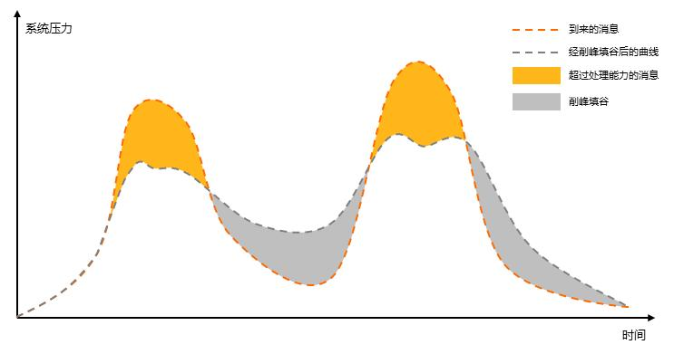

# MQ-削峰填谷

**场景：**

一般而言对于互联网项目，都可能出现高QPS的场景。

当前讨论的是由MQ来解决对应的高QPS问题。但是MQ接收方的的处理能力也是有限制的，如果上游系统不限速的发送MQ，下游系统可能因为高负荷导致服务直接被压垮。

为了避免下游系统的崩溃，常见的优化方案有两种：

1. 上游队列缓冲，限速发送
2. 下游队列缓冲，限速执行

**提要：**

MQ有两种消费模式：1.推(push)，2.拉(pull)

1. 推(Push)：服务端口主动推送消息给客户端
2. 拉(Pull)：客户端需要主动到服务端轮询获取数据

**什么是消峰填谷：**

削峰填谷采用的是消费者拉取(Pull)的方式进行MQ消费，将服务器暂时无法承载的消息堆积在MQ之中，这样流量高峰就被**削减**了，等QPS高峰期过去，下游系统将堆积的MQ处理慢慢消耗，这个过程就叫做**填谷**。整个过程让下游系统的负载维持在一定水平之内。

