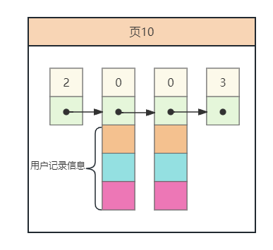

# MySQL-B+树索引

### B+树是什么？

#### 概述：

B+树是B树的一种变体，属于平衡多路查找树。

#### B+树的演变：

二叉树 -->  二叉查找树 --> 平衡二叉树 --> B树 --> B+树

##### 二叉树：

**概念：**

二叉树是n（n>=0）个结点的有限集合

1. **由一个根节点加上两棵称为左子树和右子树组成二叉树**
2. **可能为空**

**特点：**

1. **每个结点的度不超过2（可以理解为二孩政策下的结点最多只能有两个孩子**
2. **每个结点的左子树和右子树顺序不能颠倒，所以二叉树是有序树**

**任意二叉树都是由下面几种情况所组成的**

#####  二叉查找树:

**概念：**

二叉查找树(BST)也称**二叉排序树**或**二叉搜索树**，顾名思义，它的功能是为了查找数据的，它在二叉树的基础之上增加个几个限制条件。

**特点：**

1. 若它的左子树不为空，则左子树上所有节点的值都小于根节点的值。
2. 若它的右子树不为空，则右子树上所有节点的值都大于根节点的值。
3. 它的左右子树也分别为二叉搜索树。

即：对于二叉搜索树而言，其中的每个结点必然满足，**左子结点的值 < 当前结点的值 < 右子节点的值** 【如果有左右子节点的话】

##### 平衡二叉树：

**概念：**

平衡二叉树(AVL)也叫自平衡二叉搜索树（Self-Balancing Binary Search Tree），所以其本质也是一颗**二叉搜索树**。

平衡指的是**每个结点的左右子树的高度差值需要维持在1以内**，不出现左右子树高度差异过大造成数据分散不平衡的情况。

**特点：**

1. 左子树和右子树的高度之差的**绝对值小于等于1**
2. **左子树和右子树也是平衡二叉树**

左右子树的高度差被称为平衡因子**（平衡因子=右子树高度-左子树高度）**

因此平衡二叉树所有结点的平衡因子只能是 -1，0，1

##### B树：

**注意：** **B-树**就是**B树**，中间的 **-** 只是连接符，不是减号，B-树 不叫 B减树 。这个名称是由 **B-Tree** 翻译过来的，只是翻译让人误解了。

**概念：**

B树又叫**平衡多路查找树**，平衡是左右子树平衡，多路是相对于二叉而言的。

**B树的阶：**

所谓的阶指的就是当前B树中，**所有结点的的最大子节点个数**，如果最大个数为 m ,那么这个B树就称为 m阶树。**【m>=2】**

**提要：**

1. **关键字：k**

   关键字其实就是B树进行搜索的key

2. **存储值(映射数据)：v**

   对应关键字存储的数据信息value

**特点：【假如B树的阶为 m】**

1. 根节点至少有两个子节点，即子树数量范围**[2,m]**
2. 每个叶子结点结点至少有**ceil(m/2)**个子结点，这里ceil代表向上取整。**除了根节点**
3. 平衡、每个结点的所有子树高度一致，也就是说**所有的叶子节点都在同一层**
4. 对于非根结点，结点内的关键字个数范围为**[ceil(m/2)-1,m-1]**
5. 结点内各关键字互不相等且按从小到大排列。
6. 拥有二叉搜索树的性质。父结点的若干关键字作为分离值分成多个子树，左子树小于对应分离值，对应分离值小于右子树

##### B+树：

**概念：**

B+树是B树的变体，也是一种 **平衡多路查找树**，B+树与B树的基本特征一致，但是又有一些区别。

**提要：**

1. **关键字：k**

   关键字其实就是B树进行搜索的key

2. **存储值(映射数据)：v**

   对应关键字存储的数据信息value

**特点：【假如B树的阶为 m】**

1. 每个分支结点最多有m棵子树(孩子结点)。
2. 非叶根结点至少有两棵子树，其他每个分支结点至少有「m/2]棵子树。
3. 结点的子树个数与数据信息个数相等。
4. 结点的子树指针**p[i]**指向关键字值大小在**[k[i]，k[i+1])**区间之间
5. 所有叶子节点增加一个链接指针链接在一起。
6. 所有关键字及其映射数据都在叶子节点出现

B+树与B树最大的区别就是数据存放方式。B树的数据存放在每个结点，B+树的数据只存放在叶子结点。

### MySQL中的B+树索引：

#### MySQL中的B+树索引与普通B+树的区别：

1. MySQL中的结点使用的数据结构为数据页
2. MySQL中每一层的结点使用双向指针关联组成一个双向链表

#### MySQL数据页的结构：

MySQL中数据页是由许多条记录组成的

其中记录的简化结构如下：

其中各部分具体含义为：

1. record_type：记录头信息的一项属性，表示记录的类型。
   - `0`:表示普通记录
   - `1`:表示目录项记录
   - `2`:表示最小记录
   - `3`:表示最大记录
2. next_record：记录头信息的一项属性，表示下一条地址相对于本条记录的地址偏移量。
3. 各个列的值
4. 其他信息：其他隐藏列的值以及记录的额外信息。

数据页的格式：

数据页左右两侧边界为record_type = 2 和 record_type = 3 的最大最小记录，中间的是record_type = 0的普通记录或者record_type = 1的目录项记录。数据页内的行记录形成单向链表。

当record_type = 0时，记录类型就是普通的数据记录（叶子结点），存储的是具体的数据。当record_type = 1时，记录的类型就是目录项（即非叶子结点），记录会携带子页指针信息，指向子页。

#### B+树索引结构：

在Mysql中，B+树以数据页作为结点，同一层的数据页使用双向指针形成双向链表。

**非叶子结点**中的数据页组成为：最大最小记录、目录项记录

**叶子结点**的数据页组成为：最大最小记录、普通数据记录

其中数据页中将 `最小记录 -> 普通记录或者目录项记录 ->最大记录`  由单向指针串联，组成一个单向链表，这样的好处是，范围查询时或者limit时，方便查询数据。

